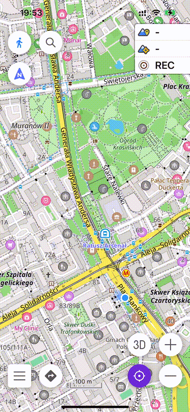
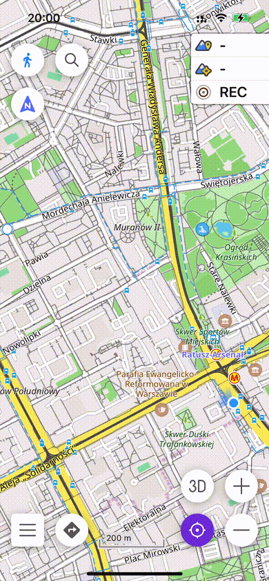
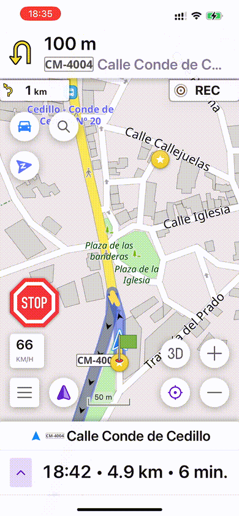
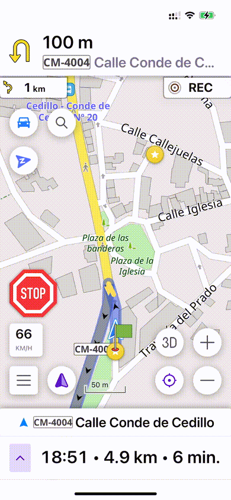
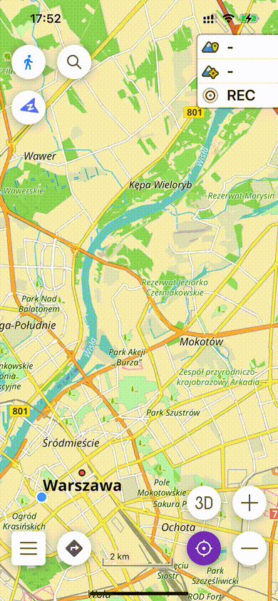
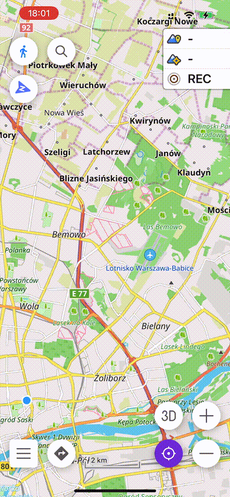

# Demo — 26 May 2026

> **OsmAnd iOS** · Sprint fixes · 3 issues resolved

---

## #5296 — Auto-activity for planned tracks

**Task:** [#5296](https://github.com/osmandapp/OsmAnd-iOS/issues/5296) · **PR:** [#5414](https://github.com/osmandapp/OsmAnd-iOS/pull/5414)

### Problem

Planned tracks did not automatically receive an activity type when saved. Recorded tracks already had this behaviour, but planned tracks were saved without any activity metadata — requiring the user to assign it manually. Additionally, the Motorcycle profile was missing a default activity entirely.

### Fix

On save, the active profile's default activity is now read and written into the GPX metadata. If the track already has an activity set, it is not overwritten. A missing default activity (`adventure_motorcycling`) was also added for the Motorcycle profile.

### Before / After

<table>
  <tr>
    <th align="center">⚠️ Before</th>
    <th align="center">✅ After</th>
  </tr>
  <tr>
    <td></td>
    <td></td>
  </tr>
</table>

---

## #5331 — Road shield size in Street Name widget

**Task:** [#5331](https://github.com/osmandapp/OsmAnd-iOS/issues/5331) · **PR:** [#5415](https://github.com/osmandapp/OsmAnd-iOS/pull/5415)

### Problem

The shield `UIImageView` had fixed `30×30` Auto Layout constraints in the XIB with `scaleAspectFit`. For shields with long text (e.g. `CM-410`), the image aspect ratio is wider than `1:1`, so `scaleAspectFit` was scaling it down to fit the `30pt` square — making the shield appear very small.

### Fix

The fixed-size constraints were replaced so the image view correctly adapts to the shield's natural aspect ratio, displaying it at full height regardless of text length.

### Before / After

<table>
  <tr>
    <th align="center">⚠️ Before</th>
    <th align="center">✅ After</th>
  </tr>
  <tr>
    <td></td>
    <td></td>
  </tr>
</table>

---

## #5365 — Incorrect map centering after double-tap zoom gesture

**Task:** [#5365](https://github.com/osmandapp/OsmAnd-iOS/issues/5365) · **PR:** [#5419](https://github.com/osmandapp/OsmAnd-iOS/pull/5419)

### Problem

`isLastMultiGesture` did not account for `_zoomingByTapGesture`, so `restorePreviousTarget` never executed after a double-tap + drag gesture. This left `fixedPixel` pinned to the touch point — causing the **My Location** button to center the map on the last touch position instead of the viewport center.

### Fix

`isLastMultiGesture` now correctly includes `_zoomingByTapGesture` in its check, ensuring `restorePreviousTarget` runs after the gesture ends and the map always recenters on the viewport center.

### Before / After

<table>
  <tr>
    <th align="center">⚠️ Before</th>
    <th align="center">✅ After</th>
  </tr>
  <tr>
    <td></td>
    <td></td>
  </tr>
</table>

---

*Generated: 26 May 2026*
